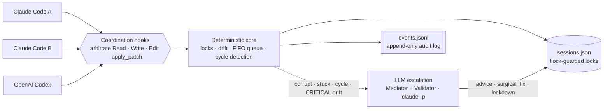
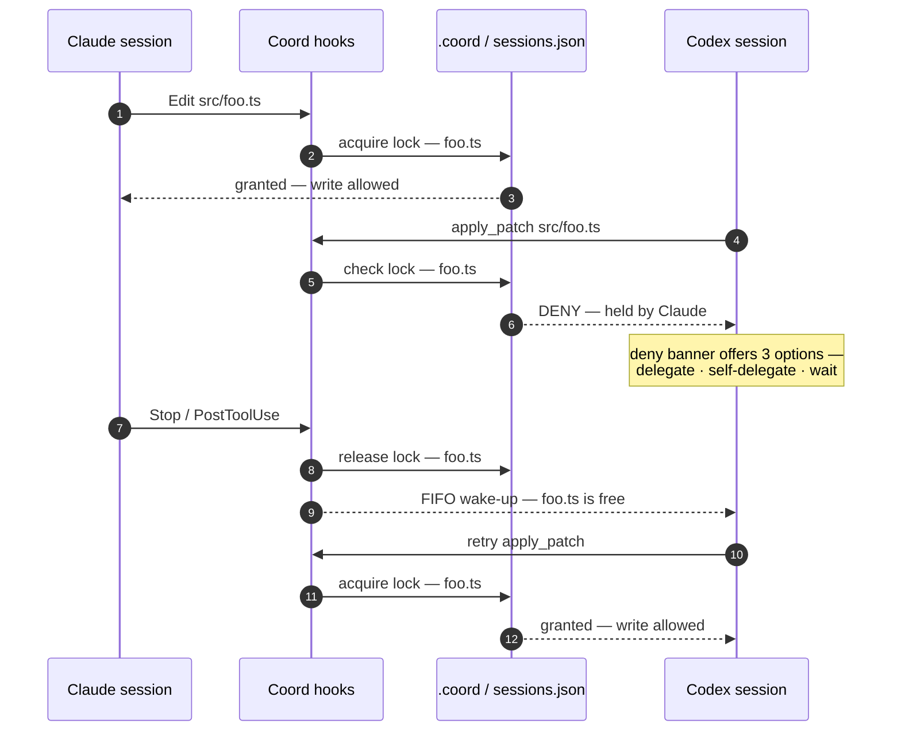
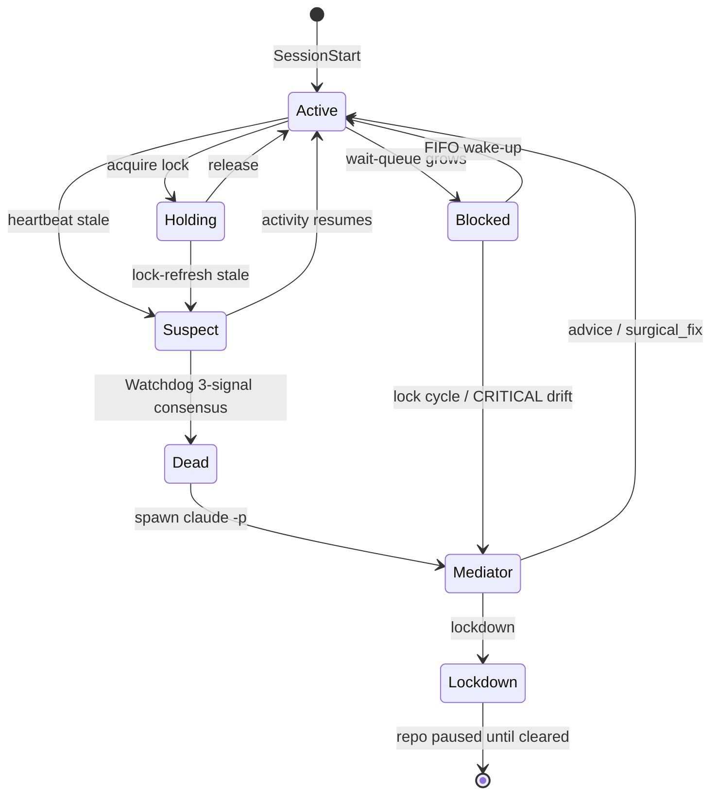

<p align="center">
  
</p>

<h1 align="center">parallel-sessions</h1>

<p align="center">
  <b>Claude Code + OpenAI Codex · 959 tests · 15 hook scripts · 0 servers</b><br>
  A coordination layer for running many AI coding sessions against one repo —
  file locking, crash recovery, and cross-session task delegation, in pure Bash.
</p>

<p align="center">
  <a href="LICENSE"></a>
  <a href="https://claude.com/claude-code"></a>
  
  
  
  
</p>

<p align="center">
  <a href="https://github.com/sezeryavuz/parallel-sessions" target="_blank" rel="noopener noreferrer"></a>
  <a href="https://github.com/sezeryavuz/parallel-sessions/issues" target="_blank" rel="noopener noreferrer"></a>
</p>

<p align="center">
  &nbsp;&nbsp;
  &nbsp;&nbsp;
  &nbsp;&nbsp;
  &nbsp;&nbsp;
  &nbsp;&nbsp;
  &nbsp;&nbsp;
  &nbsp;&nbsp;
  &nbsp;&nbsp;
  
</p>

---

Multi-session coordination for AI coding agents (Claude Code + OpenAI Codex) — prevent concurrent edits, recover from crashes, delegate work between sessions, across agent types in the same repository.

## What it does

When you run multiple AI coding sessions against the same repository, they have no awareness of each other. Two sessions can edit the same file simultaneously and clobber each other's work; one session can read a stale version of a file another has just changed; a crashed session can leave locks behind that block everyone else indefinitely.

Parallel Sessions is a coordination layer that sits between your AI coding agents and your repository. It registers hooks (Claude Code: `PreToolUse`, `PostToolUse`, `Stop`, `SessionStart`, `SessionEnd`; Codex: `PreToolUse`, `PostToolUse`, `Stop`, `SessionStart`, `UserPromptSubmit`) that observe and arbitrate every Read, Write, Edit, or `apply_patch`. Files get locked when a session starts editing them; other sessions trying to write the same file see a deny banner with three options (delegate the work, self-delegate and come back later, or wait). Stale reads are detected and classified by a Validator agent into SAFE, MINOR, or CRITICAL drift. Crashes are recovered by a Watchdog and a Mediator agent.



<p align="center"><sub><b>Figure 1 · Architecture</b> — any mix of Claude Code and Codex sessions, one coordination layer, one shared source of truth. Deterministic logic handles the common path; the LLM Mediator/Validator is spawned <i>only</i> for the hard cases.</sub></p>

The mental model is deliberately small. There is no server, no daemon, no UI. State lives at `.coord/sessions.json` (atomically edited under `flock`). The audit log lives at `.coord/events.jsonl`. The hooks are pure Bash 3.2 + `jq` + `flock`. Everything is observable; nothing runs unless an AI session triggers it.

> **Scope:** single-developer / single-machine. Multi-machine team scenarios are out of scope for v1.

## Supported agents

| Capability | Claude Code | OpenAI Codex |
|---|---|---|
| Session registration (`SessionStart` → `.coord/sessions.json` with `agent` field) | ✅ | ✅ |
| File-lock acquisition + deny banner with three options | ✅ (`Edit`/`Write`/`NotebookEdit`) | ✅ (`apply_patch`, multi-file all-or-deny atomicity) |
| Stale-read drift detection | ✅ (full-file SAFE/MINOR/CRITICAL pipeline) | ✅ (per-hunk pre-image search; structural deny) |
| Lock release (graceful) | ✅ (`Stop` + `SessionEnd`) | ✅ (`Stop` + `PostToolUse` on success) |
| Crash recovery (Watchdog) | ✅ | ✅ (symmetric — see scenario #3 below) |
| Cross-agent contention (Claude lock denies Codex `apply_patch`, and vice versa) | ✅ (verified end-to-end across 45 cross-agent integration tests) |
| In-turn banners on `PreToolUse` (drift / mediator / self-task reminder) | ✅ | ⚠️  Codex's `PreToolUse` parser explicitly rejects `additionalContext` ([upstream evidence](#why-codex-is-quieter-on-pretooluse)); Codex sessions get the bookkeeping side effects but not the banner text |
| Banners on `SessionStart` / `UserPromptSubmit` / `PostToolUse` | ✅ | ✅ |
| Mediator dispatch | ✅ (native — Mediator IS `claude -p`) | ✅ (delegated — see [D-1: Codex-only users still need claude](#d-1-codex-only-users-still-need-claude)) |

Both agents coordinate through one shared `.coord/` per repository. Mixed-mode (one Claude session + one Codex session, simultaneous) is the explicit design target and is verified end-to-end.

## Quick start

Parallel Sessions v1 ships with a Bash installer.

```bash
git clone https://github.com/sezeryavuz/parallel-sessions.git
cd parallel-sessions
```

### Default install (back-compat — Claude always; Codex auto-detected)

```bash
bash src/install.sh
# Installs the Claude Code adapter (registers .claude/settings.local.json)
# AND auto-installs the Codex adapter if `codex` is on PATH (registers
# .codex/hooks.json). Silently skips Codex if `codex` is absent.
```

### Explicit adapter selection

```bash
# Both adapters explicitly:
bash src/install.sh --with-claude-code --with-codex

# Codex only (skip Claude):
bash src/install.sh --without-claude-code --with-codex

# Claude only (skip Codex even if codex is on PATH):
bash src/install.sh --with-claude-code --without-codex
```

> The `--enable-codex-feature` flag from earlier releases is **deprecated** but still accepted as a no-op for back-compat with existing runbooks. The Codex installer now always writes `[features] codex_hooks = true` into `.codex/config.toml` (A-M-T1-04, plan v1.4) — Codex's hook discovery requires that "active config layer" alongside `hooks.json`.

Layout produced (mixed-mode, both adapters):

```
<repo>/
├── .coord/                                Shared coordination state
│   ├── sessions.json
│   ├── events.jsonl
│   ├── lib/                               Core libs (shared)
│   │   ├── atomic_write.sh, log_event.sh, ...
│   │   └── codex/                         Codex adapter libs (translator,
│   │       ├── translator.sh                apply_patch parser)
│   │       └── apply_patch_parser.sh
│   ├── hooks/                             Claude hooks (flat, 8 files)
│   │   ├── session_start.sh, stop.sh, ...
│   │   └── codex/                         Codex hooks (7 files)
│   │       ├── session_start.sh, stop.sh, ...
│   └── bin/coord                          Shared coord CLI
├── .claude/settings.local.json            Claude hook registration
└── .codex/hooks.json                      Codex hook registration
```

### Activate in your session

```bash
# Claude Code:
parallels-claude   # exports COORD_ENABLED=1 and exec's `claude`

# Codex:
parallels-codex    # exports COORD_ENABLED=1 and exec's `codex`
```

The launcher scripts (`bin/parallels-claude`, `bin/parallels-codex`) walk up from `$PWD` to find `.coord/` and refuse to start if coordination is not installed.

The installer is idempotent. To remove hook registrations: `bash src/install.sh --uninstall` (preserves `.coord/`). To fully remove: `rm -rf .coord/`.

### Optional: Claude permission bypass

`bash src/install.sh --bypass-permissions` additionally sets `permissions.defaultMode = "bypassPermissions"` in `.claude/settings.local.json`, auto-approving every Claude Code tool-permission prompt in this repo. **DANGEROUS — opt-in only.** Off by default. Useful for trusted single-developer workflows where the prompts add friction without risk; never the right default for shared or untrusted environments. Combinable with `--yes` and `--repair`. To revert, remove the `defaultMode` key from `.claude/settings.local.json`.

## Cross-agent coordination

When a Claude session and a Codex session run against the same repository, their writes are arbitrated through one `.coord/sessions.json`. Example: a Claude session is editing `src/foo.ts`; a Codex session attempts an `apply_patch` that touches the same file:

```
codex> apply_patch <<EOF
*** Begin Patch
*** Update File: src/foo.ts
@@
-old line
+new line
*** End Patch
EOF
```

Codex's `pre_tool_use_apply_patch.sh` hook fires, sees the lock held by the Claude session, and emits a `permissionDecision: deny` with a deny banner naming the holder. The patch is rejected before `apply_patch` runs; Codex's session receives an actionable message offering the same three options (delegate / self-delegate / wait). The reverse direction (Codex holds the lock, Claude attempts to `Edit`) works symmetrically.



<p align="center"><sub><b>Figure 2 · Cross-agent arbitration</b> — a Claude lock denies a Codex <code>apply_patch</code>, which receives three actionable options. When the lock releases, the FIFO queue wakes the waiting Codex session and its retry succeeds. The reverse direction is symmetric.</sub></p>

For multi-file `apply_patch`, the contract is **all-or-deny atomicity**: if any one of N target files is held by another session (of either agent type), the entire patch is denied; no partial acquire. Multi-file deny banners enumerate every blocked file with its holder.

This is verified end-to-end across 45 cross-agent integration tests covering lock contention, watchdog symmetry, schema 1.1 mixed rows, Mediator dispatch, HEAD tracking, notification fan-out, FIFO ordering, and bipartite cycle detection.

## D-1: Codex-only users still need claude

The Mediator (the agent that decides eviction, surgical-fix, or lockdown when a session goes pathological) is a `claude -p` subprocess. This is a deliberate design choice locked in early: Codex's CLI does not expose a one-shot subagent-spawn primitive equivalent to `claude -p`, so coordination decisions delegate to Claude regardless of which adapter triggered them.

Practical consequence for Codex-only operators: **install the `claude` binary even if you only use the Codex CLI day-to-day.** Without `claude` on `$PATH`, Mediator-resolved scenarios will refuse with a clear audit trail:

- Return code: `1` (clean failure, never a hang)
- `events.jsonl` entry: `{"kind":"MEDIATOR_SPAWN_REFUSED","payload":{"reason":"claude_binary_missing",...}}`
- `MEDIATOR_SPAWN_STARTED` is NOT emitted (the spawn refuses before that signal)

The signal is operator-discoverable via `coord status` or by inspecting `events.jsonl`. Coordination keeps working for the deterministic paths (lock acquisition, drift detection, FIFO wait queues, graceful release) — only the Mediator-dispatched paths require `claude`.

## Why Codex is quieter on PreToolUse

Codex's hook output parser explicitly rejects `additionalContext` on `PreToolUse` events ([`output_parser.rs:16-20`](https://github.com/openai/codex/blob/main/codex-rs/hooks/src/engine/output_parser.rs) — `PreToolUseOutput` struct has no `additional_context` field; `:337-348` — `unsupported_pre_tool_use_hook_specific_output` returns `"PreToolUse hook returned unsupported additionalContext"` when the field is non-empty, marking the hook `HookRunStatus::Failed`).

What this means in practice for Codex sessions: certain in-turn signals that Claude sessions DO see as banner text are not surfaced to the Codex agent on `PreToolUse`. The bookkeeping side effects still happen (the audit trail `events.jsonl` records them; the state mutations land in `sessions.json`); only the banner text is dropped. Specifically:

- **Stale-read drift warnings**: replaced by the structural drift gate which DENIES the `apply_patch`, so the actionable signal is preserved as a deny rather than a warning.
- **Mediator-verdict messages** (`message_to_caller`): not surfaced on `PreToolUse`. Verdict actions (lockdown, evict, etc.) still apply; the explanatory text is recorded in the verdict file at `.coord/mediator/verdict/<ts>.json` and viewable via `coord status` or direct file read.
- **Self-task reminders**: not surfaced on `PreToolUse` for Codex (the mechanism is intentionally quiet per A-D4-02). The reminders are recorded as `SELF_TASK_REMINDER` events for audit; `coord status` lists pending self-tasks. Whether the missing in-turn banner causes a real user-visible impact is an open behavior question — F.2's tests confirm the mechanism behaves as documented but did not measure user-impact directly. See `codex-integration-log.md` entry F-D4-03 for status (currently: "BEHAVIOR CONFIRMED; USER IMPACT UNKNOWN").
- **HEAD-drift banner**: surfaced via `UserPromptSubmit` instead, on the next prompt.

If you are a Codex operator wondering why a banner you'd expect on `PreToolUse` isn't appearing, this is the design — not a bug. The audit trail in `.coord/events.jsonl` is authoritative.

## Features

- **🔒 File locking with actionable deny banner** — three options offered: delegate a SIMPLE/MODERATE task to the holder, self-delegate (defer your work and come back), or wait passively for release.
- **🧩 Multi-file `apply_patch` all-or-deny atomicity** (Codex) — N-file patches succeed only if every target is free; one blocked file denies the entire patch.
- **♻️ Crash recovery** — Watchdog detects dead sessions via 3-signal consensus (PID liveness + last-activity + lock-refresh age); Mediator agent decides whether to evict, surgical-fix, or lockdown. Symmetric across agent types.
- **🧭 Stale-read drift classification** — Claude: 3-stage pipeline (cache → pre-filter → Validator agent) classifies drift as SAFE / MINOR / CRITICAL. Codex: structural per-hunk pre-image search; mismatch denies the patch.
- **⏱️ Multi-waiter FIFO queue with event-driven wake-up** — `fswatch` (macOS) / `inotifywait` (Linux) / 250 ms polling fallback. Sub-100 ms wake-up latency in the event-driven path.
- **🔗 Lock-dependency cycle detection** — bipartite session/file DFS triggered when a wait queue grows; Mediator resolves by evicting the lowest-priority session.
- **🤝 Cross-session task delegation** — a session blocked on a locked file can hand off the edit (`coord task-open`) with anchor + complexity + chain-depth + cycle-detection guards.
- **📝 Self-delegation lifecycle** — `coord self-delegate` records deferred work; reminders fire on every `PreToolUse` (Claude) and are recorded to `SELF_TASK_REMINDER` audit events on every `PreToolUse` (Codex, no in-turn banner per A-D4-02 — see `coord status` to surface pending self-tasks); `Stop` blocks once if self-tasks are unresolved.
- **🎚️ Three-mode operator switch** — `COORD_TEST_MODE=mock|semi|realistic` routes the 3 spawn sites between mock fakes and real `claude -p` for staged validation.
- **💰 Cost-guard rate-limit enforcement** — sliding-window counters guard the Mediator + Validator + Task-Processor spawn sites against runaway invocations.

## How it works

The hooks register into `.claude/settings.local.json` (Claude) and `.codex/hooks.json` (Codex) at install time. On `SessionStart`, your session is registered into `.coord/sessions.json` and assigned a coordination UUID with an `agent` field (`"claude_code"` or `"codex"`). Each agent's hooks observe and arbitrate writes specific to that agent's tool surface (Claude: `Read`/`Write`/`Edit`/`NotebookEdit`; Codex: `apply_patch` for file writes, `Bash` for audit logging, `*` for cross-cutting bookkeeping).

When something the deterministic logic cannot handle arises — corrupt state, a stuck session, a lock-dependency cycle, a CRITICAL drift verdict — a Mediator pending entry is written to `.coord/mediator/pending.jsonl` and a `claude -p` subprocess is spawned to analyze and decide. The Mediator's verdict is one of three actions: advice, surgical_fix, or lockdown. This 3-action contract is fixed by design — new failure kinds added in the future must fit it without code changes.



<p align="center"><sub><b>Figure 3 · Session lifecycle &amp; self-healing</b> — graceful release keeps the common loop cheap; crashes are caught by the Watchdog's 3-signal consensus (PID + activity + lock-refresh), and every anomaly resolves through the Mediator's fixed 3-action verdict — <code>advice</code>, <code>surgical_fix</code>, or <code>lockdown</code>.</sub></p>

## Test modes

`COORD_TEST_MODE` selects which spawn sites use real `claude -p` versus mock fakes:

| Mode | When | Mediator | Task Processor | Validator |
| --- | --- | :---: | :---: | :---: |
| **mock** | default · CI + daily dev | mock | mock | mock |
| **semi** | weekly stakes-coverage smoke | real | real | mock |
| **realistic** | pre-release smoke | real | real | real |

`mock` is fast, free, deterministic, and CI-safe. Manual stress runs:

```bash
bash scripts/stress_semi.sh
bash scripts/stress_realistic.sh
```

Output lands under `scripts/stress_<mode>_out/<ISO_ts>.log` (gitignored).

## Documentation

- [`CONTRIBUTING.md`](CONTRIBUTING.md) — setup, coding standards, PR process, codex-adapter conventions.
- [`LICENSE`](LICENSE) — MIT.
- `docs/codex-quickstart.md` — Codex-specific install and usage walkthrough (next PR; G.2).

## Status

v1 production-ready at single-developer / single-machine scale, both Claude Code and OpenAI Codex adapters. Verification surface:

| Surface | Count |
| --- | ---: |
| Unit tests (`bats src/tests/unit`) | 837 |
| Integration tests, top-level (`bats src/tests/integration`) | 77 |
| Cross-agent integration tests (`bats -r src/tests/integration/cross_agent`) | 45 |
| Integration tests total, recursive (`bats -r src/tests/integration`) | 122 |
| Ship-gate fixtures (Phase 3–7 driver scripts) | 24 |
| Architectural invariant guards — Claude (`phase7_invariant.bats`) | 19 |
| Architectural invariant guards — Codex (`codex_phase7_invariant.bats`) | 7 |

Multi-machine team scenarios are deferred to the next major version.

## Contributing

See [CONTRIBUTING.md](CONTRIBUTING.md).

## License

MIT — see [LICENSE](LICENSE).

## Acknowledgments

Built by Sezer Yavuz. Implementation arc disciplined via F-011 honest-reporting binding and ship-gate fixture methodology — every phase closed with deterministic, replayable evidence rather than aspirational claims.
